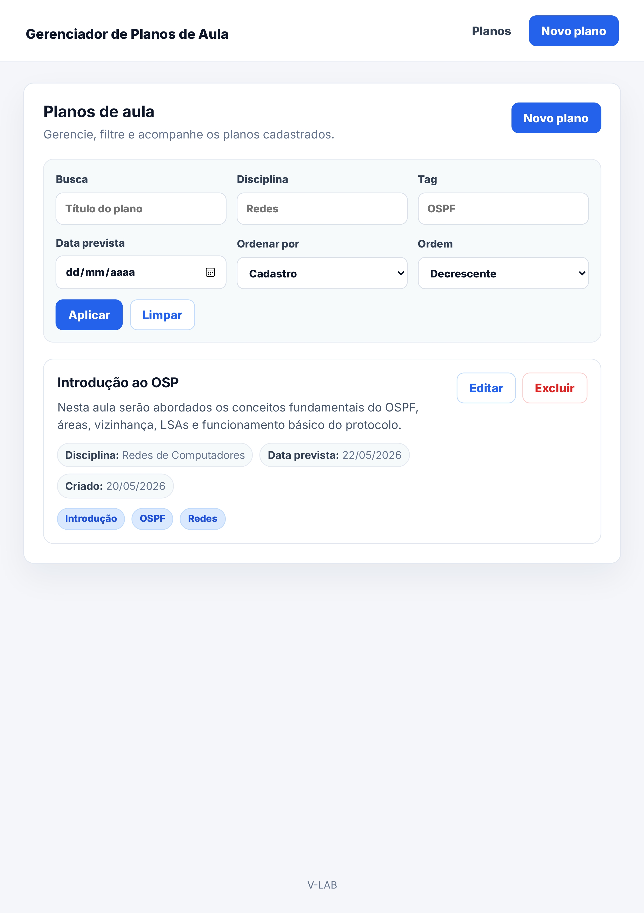
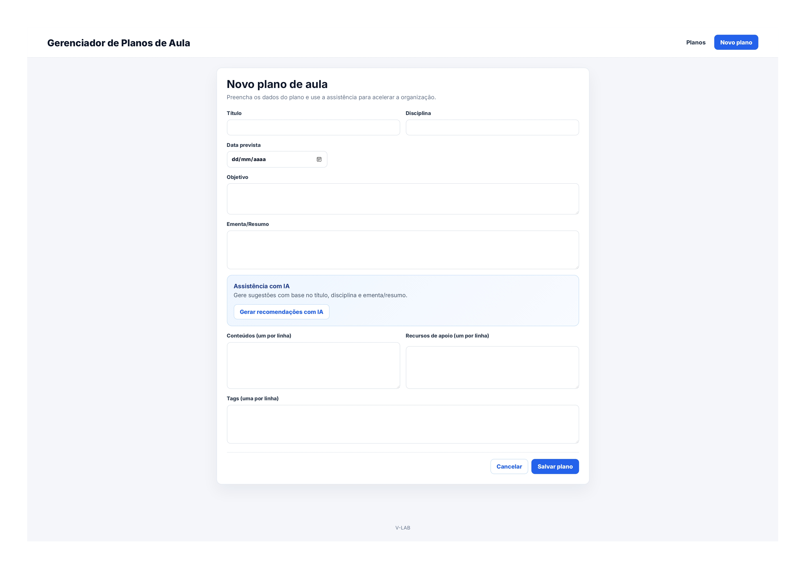
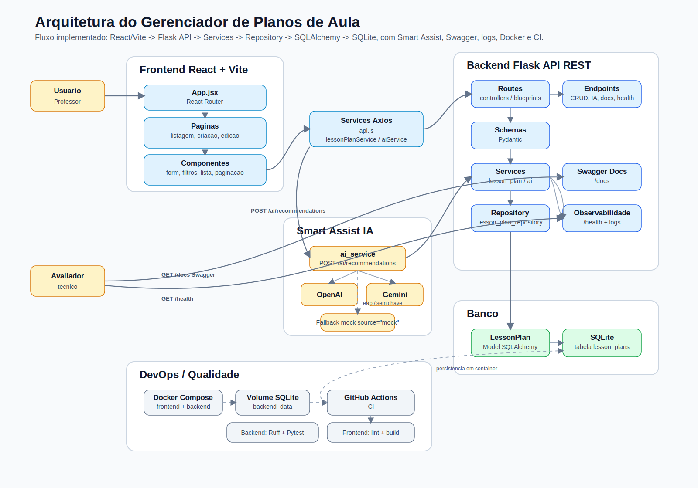

# Gerenciador de Planos de Aula


Aplicação web para cadastro, organização e consulta de planos de aula. O sistema possui um Smart Assist com IA para sugerir conteúdos complementares, tópicos relacionados e tags a partir do título, disciplina e resumo do plano.

## Sumário

- [Sobre o projeto](#sobre-o-projeto)
- [Demonstração da interface](#demonstração-da-interface)
- [Funcionalidades](#funcionalidades)
- [Tecnologias utilizadas](#tecnologias-utilizadas)
- [Arquitetura](#arquitetura)
- [Diagrama da arquitetura](#diagrama-da-arquitetura)
- [Estrutura de pastas](#estrutura-de-pastas)
- [Como executar com Docker](#como-executar-com-docker)
- [Como executar manualmente](#como-executar-manualmente)
- [Variáveis de ambiente](#variáveis-de-ambiente)
- [Documentação da API](#documentação-da-api)
- [Smart Assist com IA](#smart-assist-com-ia)
- [Testes automatizados](#testes-automatizados)
- [CI com GitHub Actions](#ci-com-github-actions)
- [Observabilidade](#observabilidade)
- [Decisões técnicas](#decisões-técnicas)
- [Limitações e melhorias futuras](#limitações-e-melhorias-futuras)
- [Autor](#autor)

## Sobre o projeto

Este projeto foi desenvolvido para o desafio técnico V-Lab. O objetivo é oferecer uma aplicação completa para gerenciar planos de aula, com backend REST, frontend SPA, persistência em SQLite, documentação via Swagger, execução com Docker e integração com IA para apoio pedagógico.

A aplicação permite que professores ou equipes pedagógicas cadastrem planos, consultem registros com filtros e paginação, editem informações e recebam sugestões automáticas por meio do Smart Assist.

## Demonstração da interface

### Tela inicial



### Criação de plano de aula



## Funcionalidades

- [x] CRUD de planos de aula
- [x] Listagem paginada
- [x] Filtros por busca, disciplina, tag e data prevista
- [x] Busca textual por título
- [x] Ordenação por título, data de criação e data prevista
- [x] Smart Assist com IA
- [x] Fallback mock para indisponibilidade, falta de quota, ausência de chave ou provider inválido
- [x] Frontend SPA com rotas de listagem, criação e edição
- [x] Swagger para documentação da API
- [x] Testes automatizados no backend
- [x] CI com GitHub Actions
- [x] Dockerfiles para backend e frontend
- [x] Docker Compose para subir a aplicação com um comando
- [x] Logs estruturados para CRUD, IA e health check
- [x] Endpoint de health check

## Tecnologias utilizadas

### Backend

- Python
- Flask
- Flask-CORS
- Flask-SQLAlchemy
- SQLite
- Pydantic
- Flasgger
- OpenAI SDK
- Google GenAI/Gemini
- Gunicorn
- Pytest
- Ruff

### Frontend

- React
- Vite
- JavaScript
- Axios
- React Router DOM
- CSS

### DevOps/Qualidade

- Docker
- Docker Compose
- GitHub Actions
- Swagger
- Logs estruturados

## Arquitetura

Fluxo geral da aplicação:

```text
Frontend React SPA
        ↓
API REST Flask
        ↓
Services
        ↓
Repositories
        ↓
SQLite
```

O backend foi organizado em camadas:

- `routes`: define os endpoints HTTP e trata entrada/saída da API.
- `schemas`: valida os dados recebidos com Pydantic.
- `services`: concentra regras de negócio, logs e integração com IA.
- `repositories`: encapsula o acesso ao banco de dados.
- `models`: define os modelos persistidos com SQLAlchemy.
- `utils`: reúne utilitários compartilhados, como configuração de logger.

## Diagrama da arquitetura



## Estrutura de pastas

```text
lesson-plan-manager-vlab/
├── .github/
│   └── workflows/
│       └── ci.yml
├── backend/
│   ├── app/
│   │   ├── repositories/
│   │   ├── routes/
│   │   ├── schemas/
│   │   ├── services/
│   │   ├── utils/
│   │   ├── config.py
│   │   ├── database.py
│   │   ├── models.py
│   │   └── swagger.py
│   ├── tests/
│   ├── .dockerignore
│   ├── .env.example
│   ├── Dockerfile
│   ├── pytest.ini
│   ├── README.md
│   ├── requirements.txt
│   ├── requirements-dev.txt
│   └── run.py
├── docs/
│   └── images/
│       ├── ArchitectureDiagram.svg
│       ├── CreatePlanPage.jpg
│       └── HomePage.jpg
├── frontend/
│   ├── src/
│   │   ├── components/
│   │   ├── pages/
│   │   └── services/
│   ├── .dockerignore
│   ├── .env.example
│   ├── Dockerfile
│   ├── index.html
│   ├── package-lock.json
│   ├── package.json
│   ├── README.md
│   └── vite.config.js
├── .gitignore
├── docker-compose.yml
└── README.md
```

## Como executar com Docker

Pré-requisitos:

- Docker Desktop instalado
- Docker Compose disponível

Na raiz do projeto, execute:

```bash
docker compose up --build
```

URLs principais:

```text
Frontend:     http://localhost:5173
Backend:      http://localhost:5000
Swagger:      http://localhost:5000/docs/
Health Check: http://localhost:5000/health
```

Para parar os containers:

```bash
docker compose down
```

Para parar os containers e apagar o volume do SQLite:

```bash
docker compose down -v
```

O banco SQLite é persistido em um volume Docker chamado `backend_data`, montado em `/app/instance`. Assim, os dados continuam disponíveis mesmo quando os containers são recriados. Ao usar `docker compose down -v`, esse volume é removido.

## Como executar manualmente

### Backend

```bash
cd backend
python -m venv .venv
source .venv/bin/activate
pip install -r requirements.txt
python run.py
```

No Windows PowerShell, ative a venv com:

```powershell
.\.venv\Scripts\Activate.ps1
```

O backend ficará disponível em:

```text
http://localhost:5000
```

### Frontend

```bash
cd frontend
npm install
npm run dev
```

O frontend ficará disponível em:

```text
http://localhost:5173
```

## Variáveis de ambiente

### Backend

- `FLASK_ENV`: ambiente de execução.
- `FLASK_DEBUG`: habilita ou desabilita modo debug.
- `PORT`: porta do backend.
- `DATABASE_URL`: URL de conexão com o banco.
- `LLM_PROVIDER`: provider de IA (`openai`, `gemini` ou `mock`).
- `LLM_API_KEY`: chave usada pelo provider configurado.
- `GEMINI_API_KEY`: chave específica do Gemini, quando utilizada.
- `GEMINI_MODEL`: modelo Gemini usado pelo Smart Assist.

### Frontend

- `VITE_API_URL`: URL base da API Flask consumida pelo frontend.

Arquivos `.env` reais não devem ser commitados. Use `.env.example` como referência e mantenha chaves sensíveis fora do versionamento.

## Documentação da API

A documentação interativa da API está disponível via Swagger:

```text
http://localhost:5000/docs/
```

Endpoints principais:

- `GET /health`
- `GET /lesson-plans`
- `POST /lesson-plans`
- `GET /lesson-plans/<id>`
- `PUT /lesson-plans/<id>`
- `DELETE /lesson-plans/<id>`
- `POST /ai/recommendations`

## Smart Assist com IA

O endpoint `POST /ai/recommendations` recebe:

- `title`
- `discipline`
- `summary`

Com esses dados, o backend monta um prompt de Assistente Pedagógico e solicita recomendações para enriquecer o plano de aula. A resposta mantém o formato:

```json
{
  "contents": ["..."],
  "related_topics": ["..."],
  "tags": ["...", "...", "..."],
  "source": "mock"
}
```

O Smart Assist suporta OpenAI, Gemini e mock. O campo `source` indica a origem da resposta, podendo ser `openai`, `gemini` ou `mock`.

Quando a API externa falha, está sem quota, sem chave válida ou com provider inválido, o sistema usa fallback mock. Nesses casos, a resposta também pode incluir o campo `warning`, sem quebrar o fluxo do usuário.

## Testes automatizados

Para rodar os testes do backend:

```bash
cd backend
python -m pytest -q
```

Os testes cobrem:

- Health check
- CRUD de planos de aula
- Validação de payloads
- Listagem com paginação
- Filtros e ordenação
- Smart Assist com mock
- Fallback para mock quando o provider não possui chave válida
- Documentação Swagger com endpoints principais

## CI com GitHub Actions

O projeto possui pipeline em `.github/workflows/ci.yml`. A CI roda em pushes para branches principais de desenvolvimento e em pull requests para `main`.

A pipeline valida:

- Instalação das dependências do backend
- Lint do backend com Ruff
- Testes do backend com Pytest
- Instalação das dependências do frontend
- Lint do frontend quando houver script disponível
- Build do frontend com Vite

## Observabilidade

O backend possui endpoint de health check em:

```text
GET /health
```

Também registra logs estruturados para operações principais:

- Criação, listagem, busca, edição e exclusão de planos de aula
- Plano não encontrado
- Health check
- Requisições do Smart Assist
- Provider, source, fallback e latência nas chamadas de IA
- Uso de tokens quando o provider disponibiliza essa informação com segurança

As chaves de API nunca são registradas nos logs.

Exemplos:

```text
[INFO] LessonPlan Created: id=1, title="Introdução ao OSPF", discipline="Redes"
[INFO] LessonPlan List: page=1, per_page=10, total_items=8
[INFO] Health Check: status="ok"
[INFO] AI Request: Title="Introdução ao OSPF", Discipline="Redes", Provider="gemini", Source="gemini", Latency=1.4s
[WARNING] AI Fallback: Provider="gemini", Reason="503 UNAVAILABLE", Source="mock", Latency=0.8s
```

## Decisões técnicas

- **SQLite**: escolhido pela simplicidade, portabilidade e facilidade de execução local.
- **Arquitetura em camadas**: separa rotas, validação, regras de negócio e persistência.
- **Fallback mock**: garante resiliência quando serviços externos de IA falham ou não estão configurados.
- **Docker Compose**: facilita a execução do backend e frontend com um único comando.
- **Swagger**: permite documentar e testar a API de forma interativa.
- **Logs estruturados**: tornam mais simples acompanhar operações principais e falhas esperadas.

## Limitações e melhorias futuras

- Autenticação de usuários
- Upload de arquivos como recursos de apoio
- PostgreSQL em produção
- Testes automatizados do frontend
- Deploy em nuvem
- Tela de dashboard com métricas
- Configuração dedicada de ESLint/Prettier no frontend

## Autor

Desenvolvido por Vinicius dos Santos Felix.
